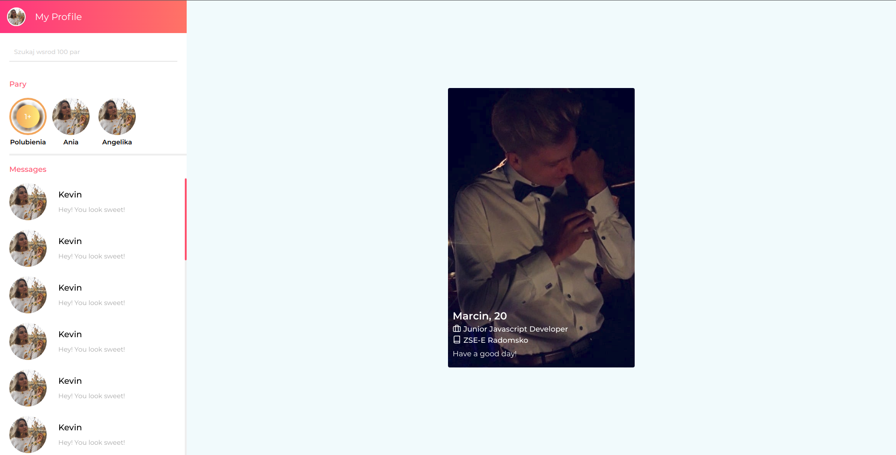
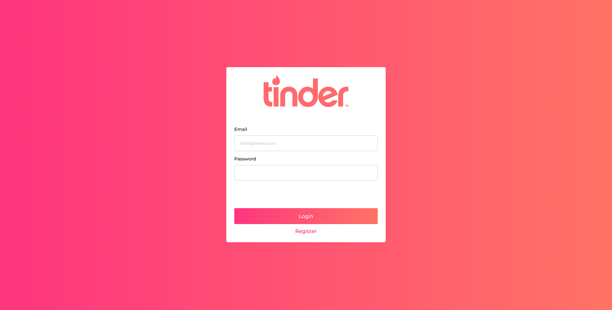
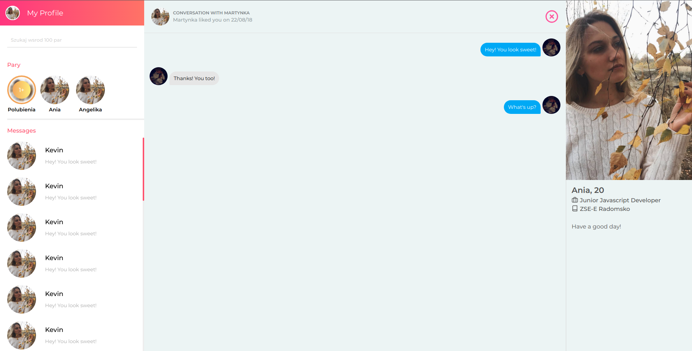

# Tinder- clone

Fullstack tinder-clone app made with React/Typescript/Nestjs/Graphql

Link to the frontend: [https://tinder-clone.netlify.com/](https://tinder-clone.netlify.com/)

Link to API: [https://evening-hamlet-82255.herokuapp.com/](https://evening-hamlet-82255.herokuapp.com/)

## Todo

-   [x] MVP (liking/disliking profiles, create matches, messages)
-   [ ] Elasticsearch
-   [ ] List of messages with pairs on sidebar
-   [ ] Settings of profile (select age range, update profile)
-   [ ] Messages infinite loading
-   [ ] Elo score ranking
-   [ ] Optimazation

## Run local

### web:

1. `git clone https://github.com/MarcinMiler/tinder-clone.git`

2. `yarn` (must be yarn because of yarn workspaces)

3. `yarn build:web`

4. `cd packages/web && yarn start`

5. If you want to use local server uncomment url in `apollo.ts`

### server:

1. `docker build -t tinder-server .`

2. `docker-compose up`

# Screens

